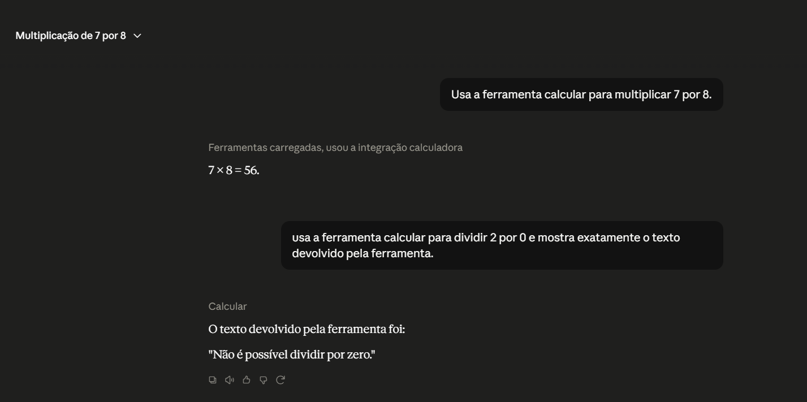
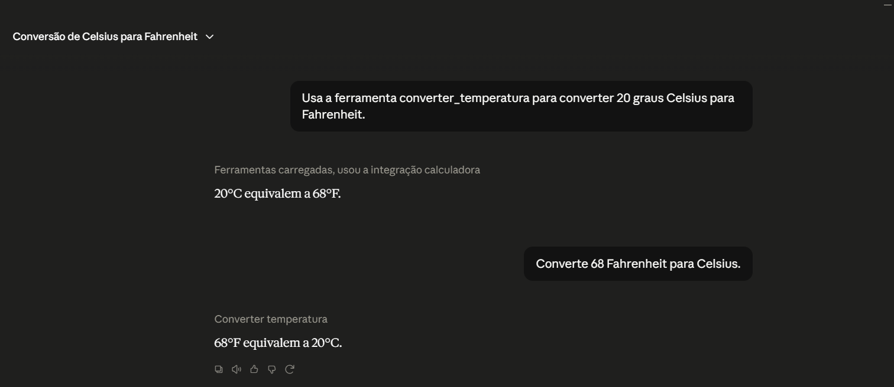
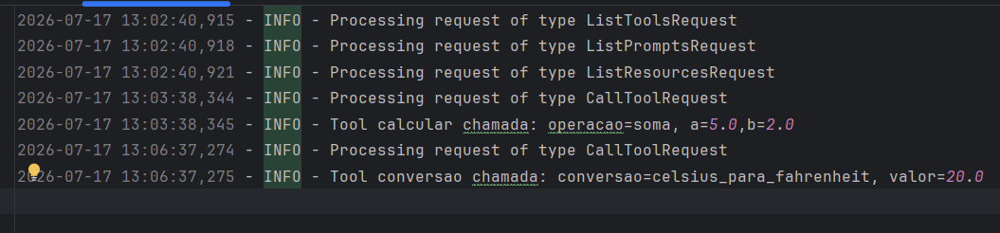
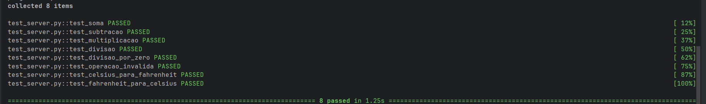

# Calculadora MCP

Este projeto foi desenvolvido em Python e consiste num servidor MCP com duas ferramentas.

Uma das ferramentas permite fazer cálculos básicos e a outra permite converter temperaturas.

## Funcionalidades

A tool `calcular` permite realizar:
- soma;
- subtração;
- multiplicação;
- divisão.

Também foi acrescentada uma verificação para impedir divisões por zero e para apresentar uma mensagem quando a operação não é válida.

A tool `converter_temperatura` permite converter:

- Celsius para Fahrenheit;
- Fahrenheit para Celsius.

## Tecnologias utilizadas

- Python
- MCP
- Pytest
- Logging

## Instalação

Para instalar as bibliotecas necessárias:

```bash
pip install -r requirements.txt
```

## Configuração no Claude Desktop
No Claude Desktop, abri as **Configurações**, entrei na área **Desenvolvedor** e cliquei em **Editar configuração**. Foi aberta a pasta onde se encontra o ficheiro `claude_desktop_config.json`. Abri esse ficheiro, adicionei a configuração abaixo, guardei as alterações e reiniciei completamente a aplicação.
```json
{
  "mcpServers": {
    "calculadora": {
      "command": "C:\\Users\\Joao\\PycharmProjects\\PythonProject3\\.venv\\Scripts\\python.exe",
      "args": [
        "C:\\Users\\Joao\\PycharmProjects\\PythonProject3\\server.py"
      ]
    }
  }
}
```

Depois de guardar esta configuração, foi necessário reiniciar o Claude Desktop para que o servidor ficasse disponível.

## Executar o servidor

Para iniciar o servidor:

```bash
python server.py
```

## Testes

Os testes automáticos podem ser executados com:

```bash
pytest -v
```

Foram criados 8 testes para verificar os cálculos, a divisão por zero, as operações inválidas e as conversões de temperatura.

## Teste da calculadora

A calculadora foi testada através do Claude Desktop.



## Teste do conversor

O conversor de temperatura também foi testado através do Claude Desktop.



## Logging

Foi criado um ficheiro chamado `server.log`.

Nesse ficheiro ficam registadas as chamadas feitas às tools, incluindo a operação escolhida e os valores recebidos.



## Testes automáticos

Os testes foram executados com sucesso.



## Ficheiros do projeto

- `server.py` – contém o servidor MCP e as duas tools.
- `test_server.py` – contém os testes automáticos.
- `requirements.txt` – contém as bibliotecas necessárias.
- `server.log` – guarda os registos das chamadas.
- Pasta `screenshots` – contém as imagens dos testes.

## Autora

Eduarda Brandão